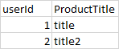
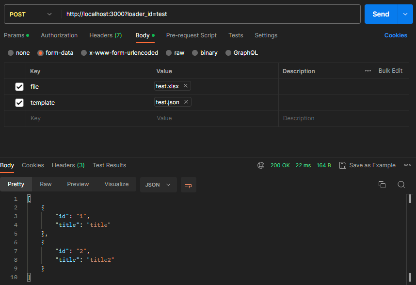

# Golang Excel Parser service
### Based on [excelize](http://github.com/xuri/excelize/v2) 
Description: web server that get Excel file and template JSON file to parse given Excel to JSON.

### It generates JSON representation of data in Excel file based on fields in template.

Template example
<pre><code>{
  "id": 1,
  "title": "Test",
  "sheet_name": "Sheet1",
  "sheet_number": 1,
  "header_row": 1,
  "start_row": 2,
  "fields": [
    {
      "id": 1,
      "name": "id",
      "field": "userId",
      "type": "string"
    },
    {
      "id": 2,
      "name": "title",
      "field": "ProductTitle",
      "type": "string"
    }
  ]
}</code></pre>

There are two environment variable:
1) <code>PORT=3000</code> - server port;
2) <code>UPLOAD_PATH=data/upload/</code> - directory for storing incoming Excel files.

### Request / Response example

From this Excel data 

To this response

It matches fields by its name and thus there is no need to place columns in particular order.

Columns not described in template would be ignored.